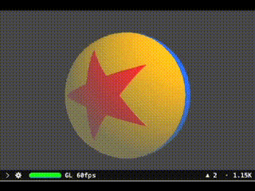
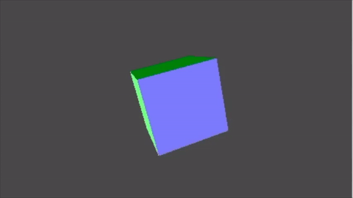
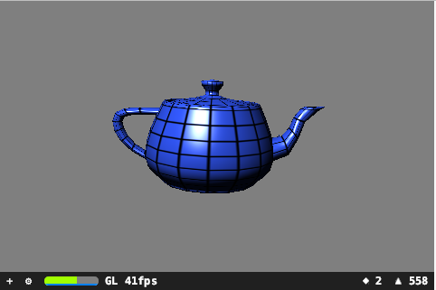

Testing GLSL shaders in SceneKit-Swift playgrounds

SceneKit programs can be prototyped in Swift playgrounds. However, macOS always defaults to GLSL version 2.1 when the rendering API is OpenGL.  Since the GLSL shaders for the  playgrounds of this repository are written for modern core profile OpenGL, a sub-class of SCNView must be instantiated to request the use of a renderingAPI of OpenGL 3.2 or later.

The programmer has 2 options when assigning an appropriate object to the "liveView" property of a Swift playground's current PlaygroundPage: 

a) an instance of NSView or
b) an instance of NSViewController.

If alternative a) is chosen, then all the relevant tasks must be performed during the instantiation of the view object. (If the view is an instance of NSOpenGLView, the method prepareOpenGL may be overridden to perform most of those tasks.)

If an instance of a sub-class of NSViewController is created, there are 2 methods named "viewDidLoad" and "viewWillAppear" which can be overridden by a sub-class of NSViewController to perform further initialisation and other tasks. Code to perform tasks immediately after the setting up of an instance of NSView and assigning it to the view controller's view property will be included in the method "viewDidLoad". The method "viewWillAppear" will have code to perform tasks prior to its view controller's view getting added to the view hierarchy.

Normally, a macOS application instantiates its view(s) by loading them from an Interface Builder file (xibs or storyboards). The loading of the nib can be automatic in macOS 10.10 or later.

A Swift playground does not need to load storyboards or xib files.  In this case, the view(s) must be instantiated manually by calling the appropriate initialization methods. In a Swift playground the "loadView" method of NSViewController should be overridden to create the view controller. That means a sub-class of NSViewController must be instantiated. The overridden "loadView" method must create the NSView object and sets view controller's "view" property. 

The code to setup each SceneKit playground or application is usually found within the method "viewDidLoad". When an offscreen renderer is used, some of the code can be moved to the method "viewWillAppear" which will be called after the "viewDidLoad" method.

Note: all transform, lighting and shading effects will be performed by the custom shaders use to instantiate the SCNPrograms.

Toyball.playground: Demonstrates procedural texturing in a SceneKit environment using GLSL shaders. A vertex-fragment shader pair is loaded and compiled to create an instance of SCNProgram. The generated texture is applied to shade a spherical object.

ColoredCube.playground: Demonstrates the well-known cube with 6 faces of different colours. The textures of each face of the cube is instantiated by invoking a geometry shader. The geometry shader using layered rendering and (geometry shader) instancing creates the cubemap texture in a single pass.

TesellateTeapot.playground: Inputs 32 Bezier Surface patches each with 16 control points; each patch is sub-divided into tiny triangles. The patch normals are computed and passed to the fragment shader for lighting effects.

Requirements:
XCode 8.x running on macOS 10.12 or later.
(XCode 8.0 can run on macOS 10.11.x)

Acknowledgements:

The GLSL shaders are written and copyrighted by the various authors.

Links:

https://stackoverflow.com/questions/53950505/how-can-i-set-a-vc-as-liveview-in-playgrounds

https://stackoverflow.com/questions/43160615/how-to-setup-viewcontroller-in-playgrounds

https://sites.google.com/site/john87connor/framebuffer/4-1-layered-rendering-cubemap

